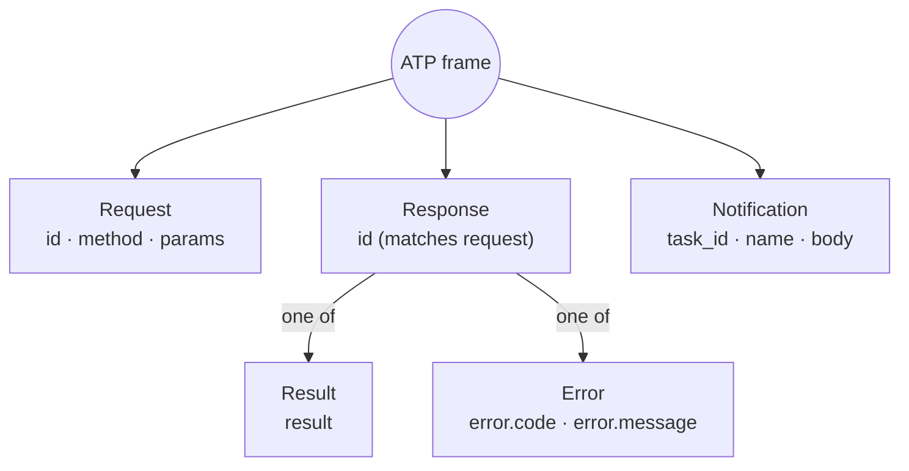

# Actor Transport Protocol (ATP)

A protocol that facilitates intelligent actor communication.

<pre>
├── <a href="#frames">Frames</a>
│   ├── <a href="#request">Request</a>
|   ├── <a href="#response">Response</a>
|   |   ├── <a href="#result">Result</a>
|   |   └── <a href="#error">Error</a>
|   └── <a href="#notification">Notification</a>
├── <a href="#protocol">Protocol</a>
│   ├── <a href="#connect">Connect</a>
│   │   ├── <a href="#request-1">Request</a>
│   │   ├── <a href="#response-1">Response</a>
│   │   └── <a href="#error-1">Error</a>
│   ├── <a href="#message">Message</a>
│   ├── <a href="#stream">Stream</a>
│   │   ├── <a href="#open">Open</a>
│   │   ├── <a href="#status">Status</a>
│   │   ├── <a href="#text">Text</a>
│   │   └── <a href="#close">Close</a>
└── └── <a href="#diagnostic">Diagnostic</a>
</pre>

## Frames

Below you will find examples of the 3 transport frame formats **request**, **response** and **notification**.



### Request

```json
{
    "id": "...",
    "method": "echo",
    "params": {
        "text": "hello world!"
    }
}
```

### Response

#### Result

```json
{
    "id": "...",
    "result": "ok, done!"
}
```

#### Error

```json
{
    "id": "...",
    "error": {
        "code": -32001,
        "message": "user not found!"
    }
}
```

ATP error codes are signed integers. The protocol defines the standard
JSON-RPC codes below and permits application-specific extension codes.

| Code | Name | Meaning |
| ---: | --- | --- |
| `-32700` | Parse error | Malformed JSON syntax or an incomplete JSON document |
| `-32600` | Invalid request | A valid JSON value that is not a valid ATP frame |
| `-32601` | Method not found | The requested ATP method is unsupported |
| `-32602` | Invalid params | Request parameters failed validation |
| `-32603` | Internal error | The receiver could not complete the operation |

### Notification

```json
{
    "task_id": "...",
    "name": "progress",
    "body": {
        "message": "loading..."
    }
}
```

## Protocol

### WebSocket Transport

The broker exposes ATP at `/agents/connect`. The HTTP upgrade does not carry
agent identity or credentials in headers or the URL. Clients must send a
`connect` request as the first ATP frame within 10 seconds.

The broker accepts ATP JSON in text or binary WebSocket messages and emits
binary messages. Requests receive a response with the same `id`. The broker
uses close code `1007` for malformed JSON, `1008` for authentication,
protocol-policy, or extension-code failures, and `1011` for internal ATP or
WebSocket transport failures. Close reasons are stable public descriptions;
detailed internal errors are logged rather than exposed to the peer.

An ATP error response does not close the connection by itself. Validation and
application errors may be returned while the session remains open. The broker
only sends a WebSocket close frame when the surrounding session flow marks the
failure as terminal, such as a failed handshake or an internal persistence
failure.

### Connect

Called once upon client connection to authenticate.

#### Request

```json
{
    "id": "...",
    "method": "connect",
    "params": {
        "id": "019fb92c-e616-716f-9768-16c4753fe9d9",
        "name": "test",
        "description": "a test agent",
        "secret": "...",
        "skills": [
            {
                "name": "echo",
                "display_name": "Echo",
                "description": "I echo back what you say"
            }
        ]
    }
}
```

#### Response

An `ack` response with no result data.

```json
{
    "id": "..."
}
```

#### Error

An `nack` response with an error.

```json
{
    "id": "...",
    "error": {
        "code": -32600,
        "message": "invalid agent credentials"
    }
}
```

### Message

After connecting, an agent can send a message to an existing chat in which it
is a member. The request `id` is also used as the Mage trace ID. The current
broker rejects non-null `reply_to_id` values until reply relationships are
supported by the domain model.

#### Request

```json
{
    "id": "019fb92c-e616-716f-9768-16c4753fe9d8",
    "method": "message",
    "params": {
        "chat_id": "019fb92c-e616-716f-9768-16c4753fe9d7",
        "reply_to_id": null,
        "content": [
            {
                "type": "text",
                "text": "hello world"
            }
        ],
        "metadata": {}
    }
}
```

#### Response

```json
{
    "id": "019fb92c-e616-716f-9768-16c4753fe9d8"
}
```

### Stream

#### Open

Opens a new task stream with an id we will use
to emit all notifications until the final `stream.close`.

```json
{
    "task_id": "...",
    "name": "stream.open",
    "body": {
        "stream_id": "..."
    }
}
```

#### Status

Incremental status updates.

```json
{
    "task_id": "...",
    "name": "stream.status",
    "body": {
        "stream_id": "...",
        "index": 3,
        "code": "thinking|planning|working|waiting",
        "message": "..."
    }
}
```

#### Text

Text can be appended (`span == null`) or splice from a range (`span != null`).

```json
{
    "task_id": "...",
    "name": "stream.text",
    "body": {
        "stream_id": "...",
        "index": 3,
        "text": "hello world",
        "span": {
            "start": 3,
            "end": 5
        }
    }
}
```


#### Close

Emitted as the final frame for a `stream_id`, with the optional
ability to provide a `message` to go with the `reason`.

```json
{
    "task_id": "...",
    "name": "stream.close",
    "body": {
        "stream_id": "...",
        "reason": "completed|cancelled|failed",
        "message": "..."
    }
}
```

### Diagnostic

Emitted to alert the platform and other agents of system happenings.

```json
{
    "$meta": {
        "trace_id": "...",
        "span_id": "...",
        "sent_at": "2026-07-30T02:55:00.000Z"
    },
    "task_id": "...",
    "name": "diagnostic",
    "body": {
        "level": "info|warn|error",
        "code": "stream.started",
        "message": "Model output stream started",
        "data": {
            "stream_id": "...",
            "model": "..."
        }
    }
}
```
